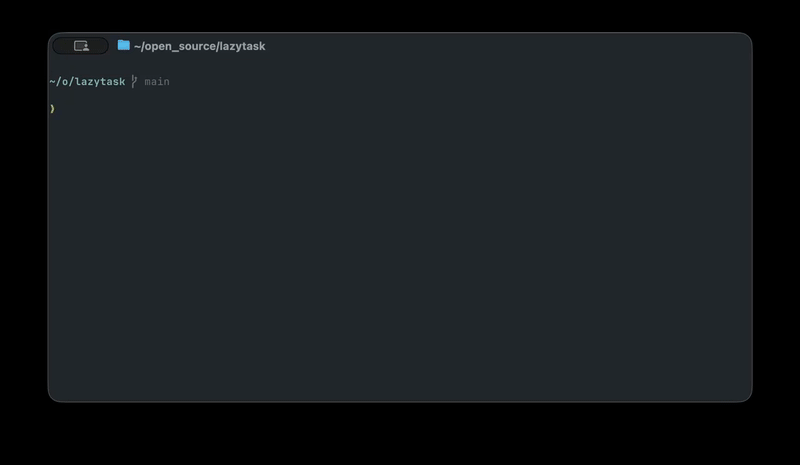

<div align="center">

# lazytask `lt`

**AI-first task management. Human in command.**

Built in Rust. Fast to run, easy to understand.

[](https://ratatui.rs/)
[](https://www.rust-lang.org/)
[](LICENSE)

[Getting started](#getting-started) · [How it works](#how-it-works) · [Commands](#commands) · [Configuration](#configuration)

<br>



</div>

---

## Why lazytask?

**Your AI agent needs a task manager it can actually use** — and you need a way to stay in control. lazytask is both: a strict CLI for agents, a keyboard-driven TUI for humans.

No sync. No server. No database. Just files.

> **Sophisticated simplicity** — if you can't do it on a whiteboard, you can't do it in lazytask.

## How it works

lazytask has two interfaces that share the same storage:

| | Human | AI agent |
|---|---|---|
| **Interface** | Keyboard-driven TUI | Strict CLI with JSON envelopes |
| **Launch** | `lt` | `lt list`, `lt create`, ... |
| **Workflow** | Navigate, create, move tasks | Create, start, complete tasks with learnings |

Tasks flow through directories — what you see in your file tree *is* the state:

```sh
.tasks/
├── todo/           # up to 20 tasks (configurable)
├── in-progress/    # up to 3 tasks (focus!) (configurable)
├── done/           # completed work
├── discard/        # intentionally excluded
└── LEARNINGS.md    # Required learnings from each completed task
```

Each task is a single `.md` file. Moving a task from `todo` to `in-progress` is literally moving a file.

> `.tasks` can be included in git, but I'd discourage it. `lazytask` tasks are meant to be post-its next to you on your desk.

## No learning? No completion.

Most agents finish a task and forget everything. lazytask won't let them.

When an agent completes a task, it must record a **learning** — what worked, what surprised it, what to do differently. These learnings accumulate in `LEARNINGS.md`. When enough have built up, you prompt your agent that it's time to learn, and it distills those insights into concrete improvements to docs, workflows, or code — with you in control. No opaque auto-memory.

**The feedback loop:** agents do work → record learnings → you trigger learning → agents distill insights → better code.

## Getting started

### Install

Install instructions coming soon

### Quick start

```bash
lt init    # creates .tasks/ layout + config file + agent guidance
lt         # opens the TUI
```

`lt init` also appends usage instructions to your `AGENTS.md` (or `CLAUDE.md`), so your AI agent knows how to use `lt` immediately.

## Commands

### Human commands

| Command | Description |
|---|---|
| `lt` | Open the TUI |
| `lt init` | Initialize lazytask in your project |

### AI commands

All AI commands return a consistent JSON envelope: `{"ok": bool, "data": ...}` or `{"ok": false, "error": {...}}`.

| Command | Description |
|---|---|
| `lt list [--type task\|bug] [--show-done]` | List tasks |
| `lt get <query>...` | Get task details |
| `lt create --title "..." --type task\|bug --details "..." [--start]` | Create a task |
| `lt start <query>` | Move task to in-progress |
| `lt done <query> --learning "..."` | Complete task with a learning |
| `lt discard <query>` | Discard a task |
| `lt learn` | Distill learnings into improvements |

## Configuration

`lazytask.toml` in your project root:

```toml
[limits]
todo = 20          # max tasks in todo
in_progress = 3    # max tasks in progress

[hints]
learn_threshold = 35
```

## Acknowledgements

lazytask's TUI is built with [ratatui](https://github.com/ratatui/ratatui), and its TUI UX draws heavy inspiration from [lazygit](https://github.com/jesseduffield/lazygit).

## License

MIT
